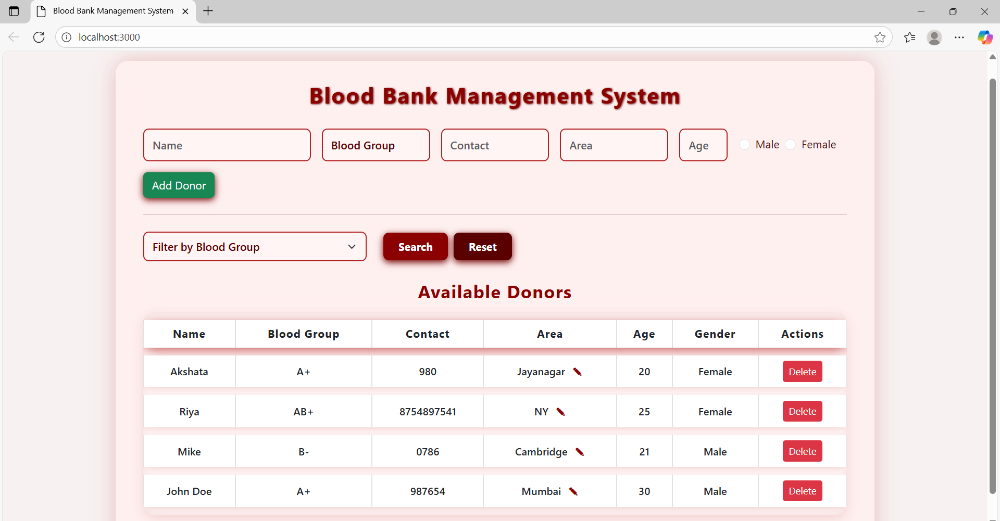

Blood Bank Management System

A web-based mini project using MongoDB to store, manage, and retrieve blood donor details. It allows hospitals and blood centers to manage donors efficiently with an easy-to-use interface.
Features
* Add new donors with details: Name, Blood Group (+/-), Contact, Area, Age, Gender

* Search donors by blood group

* View available donors in a structured table

* Edit or delete donor records

* Real-time updates

Technology Stack
* Backend: Node.js, Express.js

* Database: MongoDB Atlas

* Frontend: HTML, CSS, JavaScript
  
Usage
* Use the interface to add donors, filter by blood group, and manage donor records.

Screenshot

Future Enhancements
* JWT Authentication (Admin/User roles)

* Admin dashboard with analytics

* Email/SMS alerts for urgent blood requests

* PDF download for donor reports
* 
Contributing
* Contributions are welcome! Fork the repo and submit pull requests.

License
* MIT License
